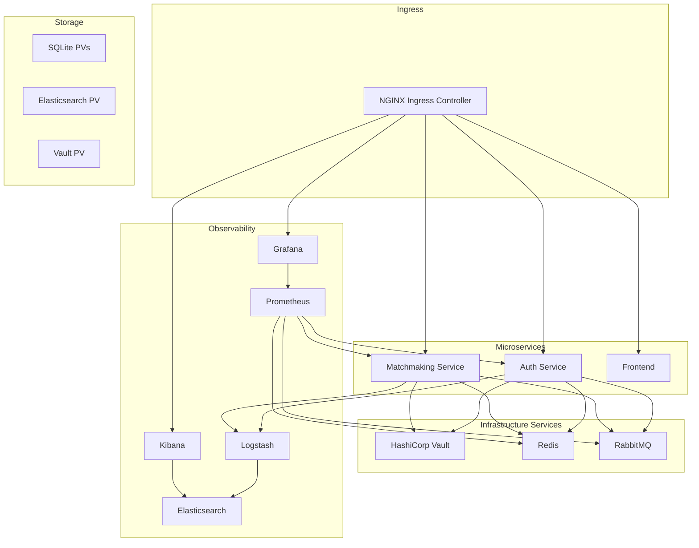

# ft_transcendence - Infrastructure Module

Ce module gère l'infrastructure complète du projet `ft_transcendence`, incluant l'orchestration des conteneurs, la gestion des secrets, le logging, et le monitoring.

## Pré-requis

- **Linux** (Testé sur Ubuntu/Debian)
- **K3s** : Kubernetes léger pour l'orchestration
- **kubectl** : Outil de ligne de commande Kubernetes
- **Helm** : Gestionnaire de paquets pour Kubernetes
- **Docker** : Pour la construction des images (ou conteneurisation alternative compatible CRI)

## Architecture

L'infrastructure repose sur un cluster Kubernetes (K3s) hébergeant les microservices applicatifs ainsi que les services d'infrastructure transverses.



## Structure des Dossiers

| Dossier       | Description                                                      |
| ------------- | ---------------------------------------------------------------- |
| `k8s/`        | Manifests Kubernetes organisés avec Kustomize (base/overlays)    |
| `helm/`       | Charts Helm personnalisés et fichiers de valeurs (`values.yaml`) |
| `vault/`      | Configuration et policies pour HashiCorp Vault                   |
| `dashboards/` | Dashboards JSON pour Grafana et visualisations Kibana            |
| `scripts/`    | Scripts d'automatisation (setup, init, maintenance)              |

## Quickstart

Un `Makefile` (à venir) orchestrera le déploiement. Voici les commandes prévues :

```bash
# Démarrage complet de l'infrastructure
make up

# Arrêt propre
make down

# Vérification de l'état des services
make status
```

## Composants Déployés

| Composant           | Rôle                             | Namespace    |
| ------------------- | -------------------------------- | ------------ |
| **HashiCorp Vault** | Gestion centralisée des secrets  | `vault`      |
| **Elasticsearch**   | Base de données de logs          | `logging`    |
| **Logstash**        | Ingestion et traitement des logs | `logging`    |
| **Kibana**          | Visualisation des logs           | `logging`    |
| **Prometheus**      | Collecte de métriques            | `monitoring` |
| **Grafana**         | Tableaux de bord de monitoring   | `monitoring` |
| **RabbitMQ**        | Message Broker                   | `production` |
| **Redis**           | Cache et session store           | `production` |
