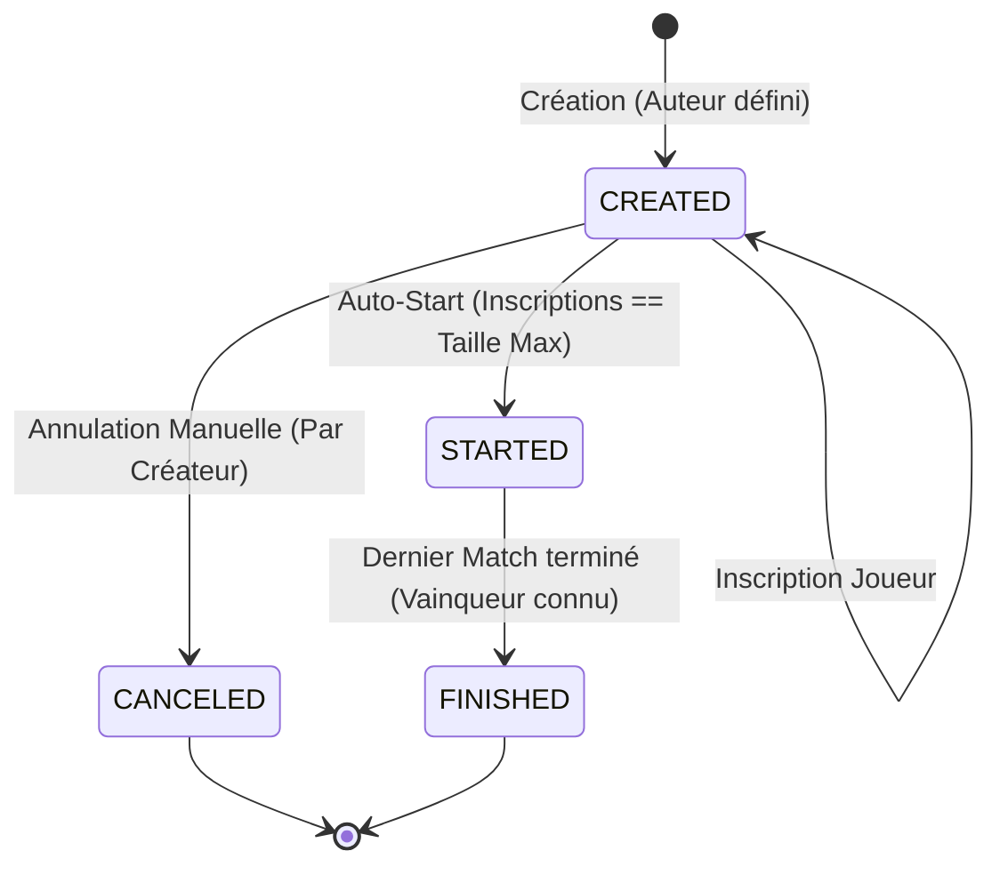

# 📘 Document de Conception du Domaine : Tournament Service

Ce document fait autorité sur le comportement métier du microservice.

## 1. Langage Omniprésent (Ubiquitous Language)

Ces termes doivent être utilisés tels quels dans le code (noms de classes, variables, fonctions).

* **Tournament (Tournoi) :** L'agrégat racine. Une compétition à élimination directe.
* **Bracket (Arbre) :** La structure complète des matchs générée au début du tournoi.
* **Participant :** Une entité qui joue. Il peut être de deux types :
    * *Registered Player :* Un utilisateur connecté (possède un ID global).
    * *Guest Player :* Un invité (possède un alias temporaire et un ID de session).
* **Round (Tour) :** Une étape du tournoi (ex: Quart de finale, Demi-finale).
* **Match :** Une confrontation entre deux participants (ou un participant et un "vide" en attente).
* **Walkover (Forfait) :** Victoire automatique déclarée lorsqu'un adversaire est absent ou abandonne.

---

## 2. Invariants & Règles Métier (Business Rules)

Ces règles sont strictes. Toute tentative de violation doit lever une Exception Domaine.

### 🏗 Configuration & Structure
1.  **Taille Fixe :** Un tournoi ne peut être créé qu'avec une capacité stricte de **4, 8 ou 16** participants. Toute autre valeur est invalide.
2.  **Paramètres Standards :** La configuration du jeu (Vitesse, Score max, Taille du paddle) est immuable et standard pour tous les tournois (responsable : game service).

### 📝 Inscriptions & Identité
3.  **Identité Unique :** Un utilisateur enregistré (User ID) ne peut pas s'inscrire deux fois dans le même tournoi.
4.  **Unicité des Alias :** Dans un même tournoi, deux participants (Invités ou Enregistrés) ne peuvent pas avoir le même `displayName` visible.
5.  **Exclusivité (Cross-Tournoi) :** Un joueur enregistré ne peut pas rejoindre un tournoi `CREATED` ou `STARTED` s'il est déjà actif dans un autre tournoi `STARTED` ou `CREATED`.
6.  **Fermeture & Auto-Start :** À l'instant précis où le nombre de joueurs atteint la capacité max (`size`), les inscriptions sont closes et le tournoi passe automatiquement à l'état `STARTED`.

### ⚔️ Déroulement (Engine)
7.  **Génération Anticipée :** L'arbre complet des matchs (Bracket) est généré intégralement au moment de la transition vers `STARTED`. Les matchs futurs contiennent des placeholders ("TBD").
8.  **Placement Aléatoire :** Lors du démarrage, la liste des participants est mélangée aléatoirement avant d'être assignée aux matchs du premier tour.
9.  **Avancement Automatique :**
    * Le vainqueur d'un match est immédiatement inscrit dans le match du tour suivant.
    * Le perdant est éliminé.
10. **Gestion du Forfait (Walkover) :** Si un joueur abandonne ou est déconnecté au-delà du délai autorisé, le match passe en statut `FINISHED` avec le flag `winReason: WALKOVER`. L'adversaire avance au tour suivant.

### 🏁 Cycle de Vie & Intégrité
11. **Annulation Restreinte :** Un tournoi ne peut être annulé (`CANCELED`) que s'il est encore en phase d'inscription (`CREATED`). Une fois démarré, il doit se terminer ou être résolu par forfaits.
12. **Finalisation :** Le tournoi passe à l'état `FINISHED` immédiatement après la fin du dernier match (Finale). Le vainqueur est alors historisé dans l'agrégat.

---

## 3. Modélisation des États (State Machine)

L'agrégat `Tournament` ne peut se trouver que dans un de ces états. Les transitions sont strictes.



### Détails des transitions

* **CREATED :** Le tournoi accepte les joueurs.
* **STARTED :** Le bracket est figé, les matchs sont créés. Impossible d'ajouter/retirer des joueurs. Impossible d'annuler.
* **CANCELED :** État final cul-de-sac. Uniquement accessible depuis `CREATED`.
* **FINISHED :** État final. Le vainqueur est historisé.

---

## 4. Structure des Objets du Domaine (Entités)

Voici à quoi ressembleront vos classes TypeScript dans `src/tournament/domain`.

### A. Tournament (Aggregate Root)

```typescript
class Tournament {
    id: string;
    props: {
        name: string;
        size: 4 | 8 | 16;
        status: 'CREATED' | 'STARTED' | 'FINISHED' | 'CANCELED';
        participants: Participant[];
        matches: Match[]; // Liste plate ou structure d'arbre
    }
    
    // Comportements
    join(player: Participant): void;
    cancel(): void;
    start(): void; // Privé, appelé automatiquement par join()
    processMatchResult(matchId: string, result: MatchResult): void;
}

```

### B. Participant (Value Object)

```typescript
class Participant {
    id: string;      // UUID (DB ID pour Registered, SessionID pour Guest)
    type: 'USER' | 'GUEST';
    displayName: string;
}

```

### C. Match (Entity)

```typescript
class Match {
    id: string;
    round: number;   // 1 = 1er tour, 2 = 2ème tour...
    position: number; // Position dans le tour
    playerA: Participant | null; // Null si pas encore qualifié
    playerB: Participant | null;
    winner: Participant | null;
    status: 'PENDING' | 'IN_PROGRESS' | 'FINISHED';
}

```

---

## 5. Scénario critique : Le "Happy Path"

Pour valider que ces règles fonctionnent, voici le déroulé séquentiel d'un tournoi à 4 joueurs :

1. **Création :** `UserA` crée "Tournoi Super". État `CREATED`. `UserA` est inscrit d'office (1/4).
2. **Inscription :** `UserB`, `Guest1` et `Guest2` rejoignent.
3. **Auto-Start (Invariants 5 & 7) :**
* Le 4ème joueur rejoint.
* Le système mélange : [`Guest1`, `UserA`, `Guest2`, `UserB`].
* Le système génère 3 matchs (Invariant 6) :
* Match 1 (Round 1) : `Guest1` vs `UserA`
* Match 2 (Round 1) : `Guest2` vs `UserB`
* Match 3 (Finale) : `TBD` vs `TBD`


* État passe à `STARTED`.


4. **Déroulement Match 1 :** `UserA` gagne.
* Match 1 Status -> `FINISHED`.
* Match 3 (Finale) met à jour PlayerA -> `UserA`.


5. **Déroulement Match 2 :** `UserB` se déconnecte (Invariant 9).
* `Guest2` gagne par Walkover.
* Match 3 (Finale) met à jour PlayerB -> `Guest2`.


6. **Finale :** Le Match 3 est maintenant complet (`UserA` vs `Guest2`). Il passe à `IN_PROGRESS`.
7. **Fin :** `UserA` gagne la finale.
* Tournoi passe à `FINISHED`.
