## TODO
- Regler le probleme de memoire de rabbitmq
- Desactiver l'envoie de requetes (/games/game/active) lorsqu'on tape des caracteres dans un imput

- Corriger le visuel / limiter le nombre de caracteres dans la bio :

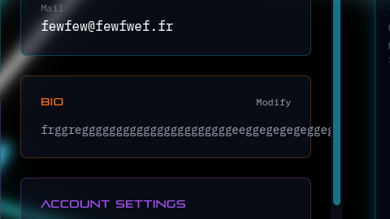

- Delete avatar n'est pas utilise : A activer ou a supprimer

- Bouton entree ne marche pas Activation 2FA

- Apres activation 2FA, lors de la connexion (OnlineUsersProvider.tsx ???):

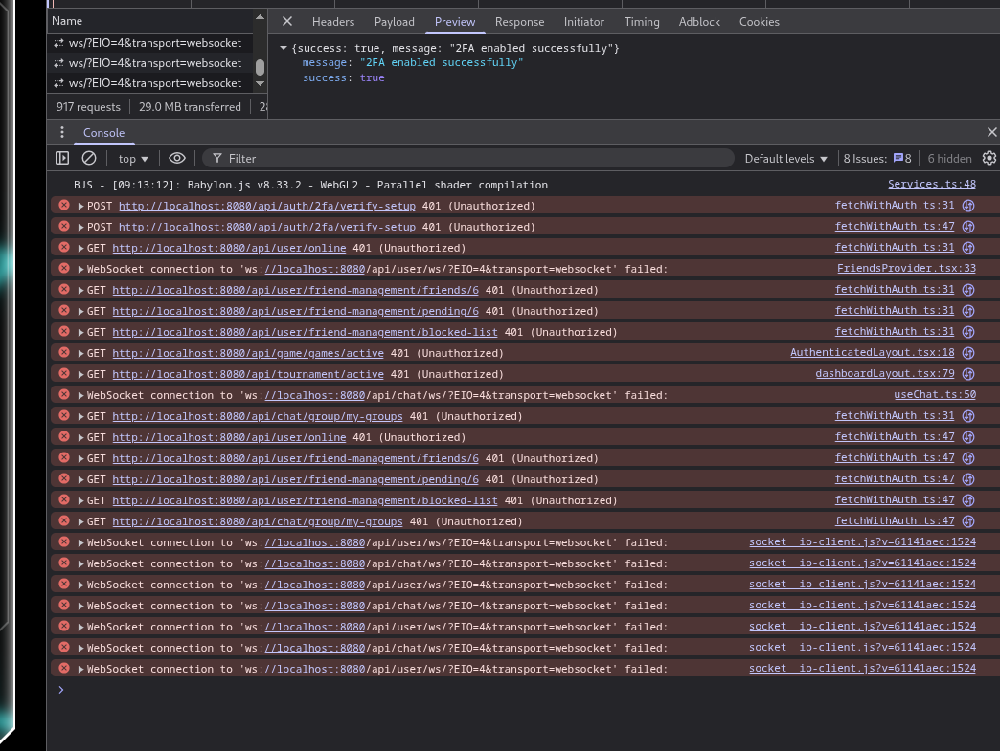

- Faire des tests en tournoi/match/matchmaking et supprimer le compte en meme temps

- Ne se met pas a jour si on envoie la requete de mise a jour via l'API :

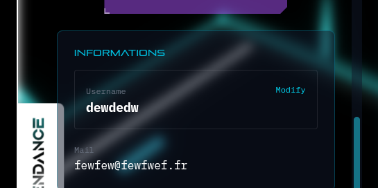

- Parsing des emails ([register](http://localhost:8080//api/auth/register)):

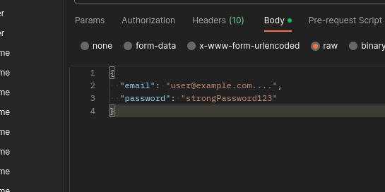

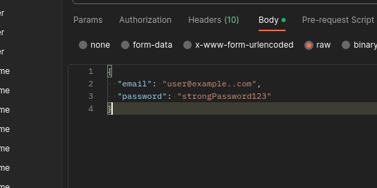

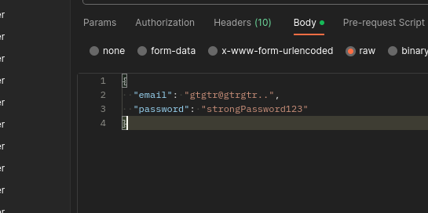

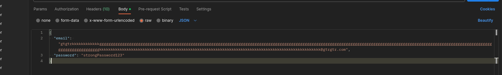

- Parsing du password :

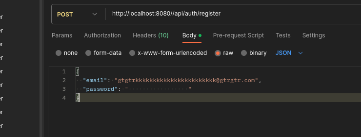

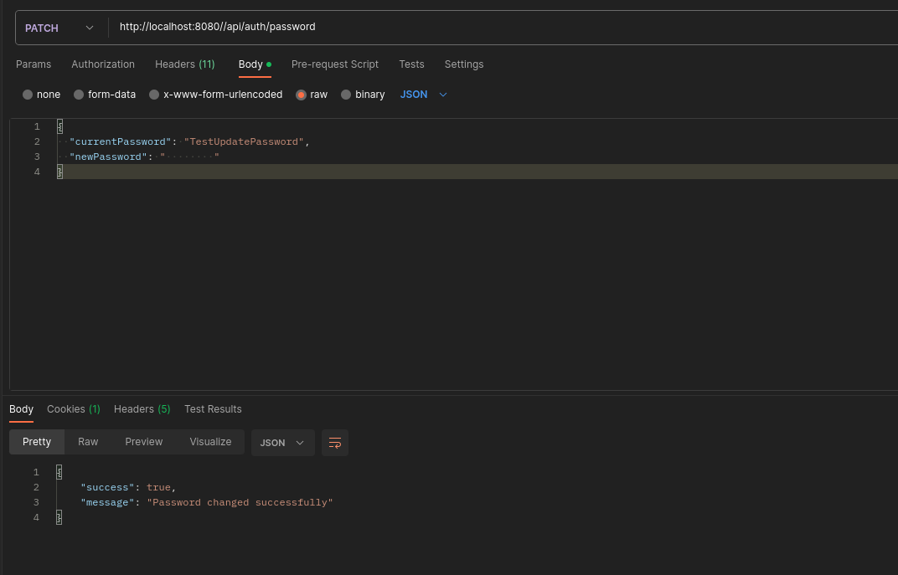

- Refresh tokens:

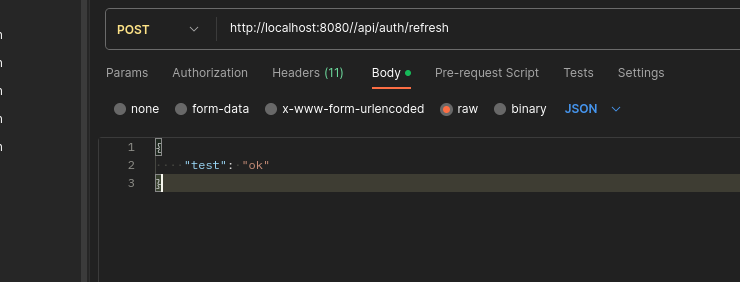

Usernames :

- Creer un compte, modifier l'username via la route POST /api/auth/username, /me renvoie l'ancien username, impossible de creer un user avec le nouveau username malgre qu'il ne correspond pas a l'user, PATCH lui fonctionne

Liste amis devrait etre Not Found :

| **GET** | `/friends/:userId` | Get friend list | No | - |
| **GET** | `/pending/:userId` | Get pending requests | No | - |

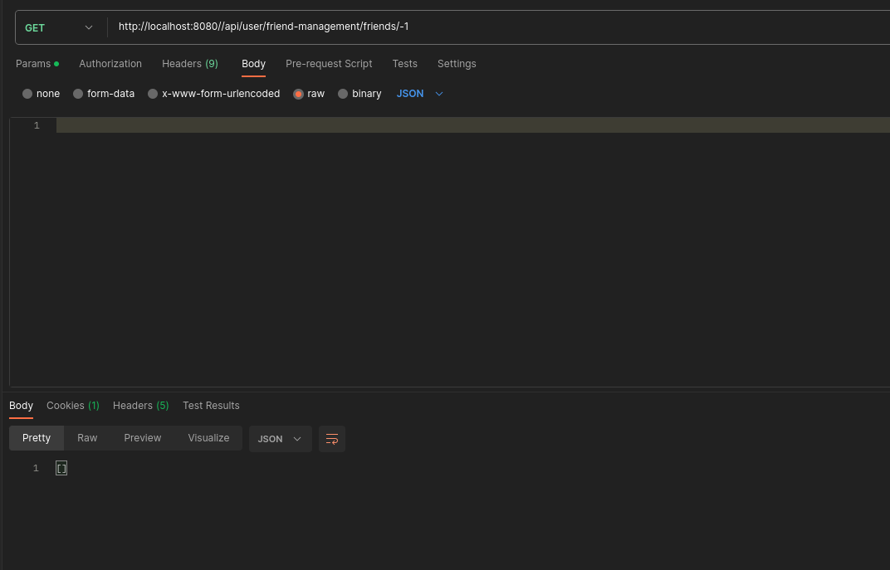

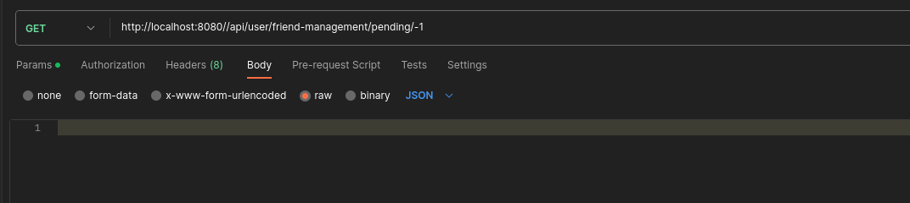

Invitations :
| **POST** | `/invite` | Send friend request (ID) | Yes | `FriendManagementDto` |

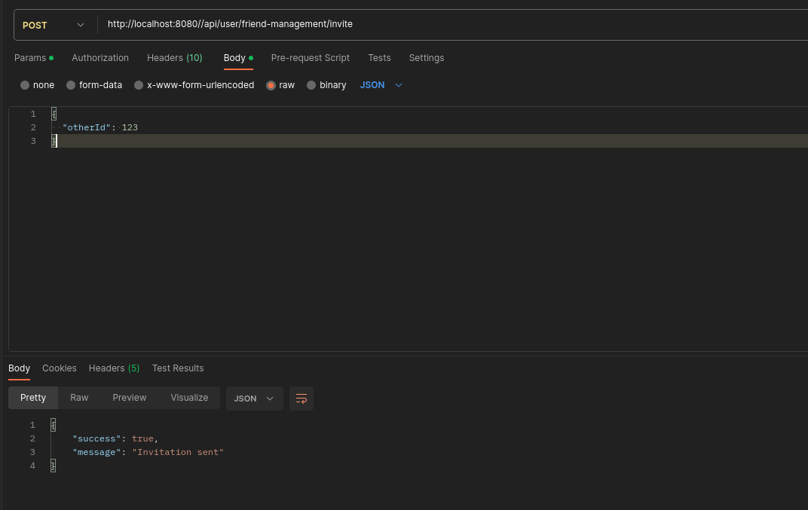

Manipulation du senderUsername :
| **POST** | `/invite-by-username` | Send request (Username) | Yes | `InviteByUsernameDto` |
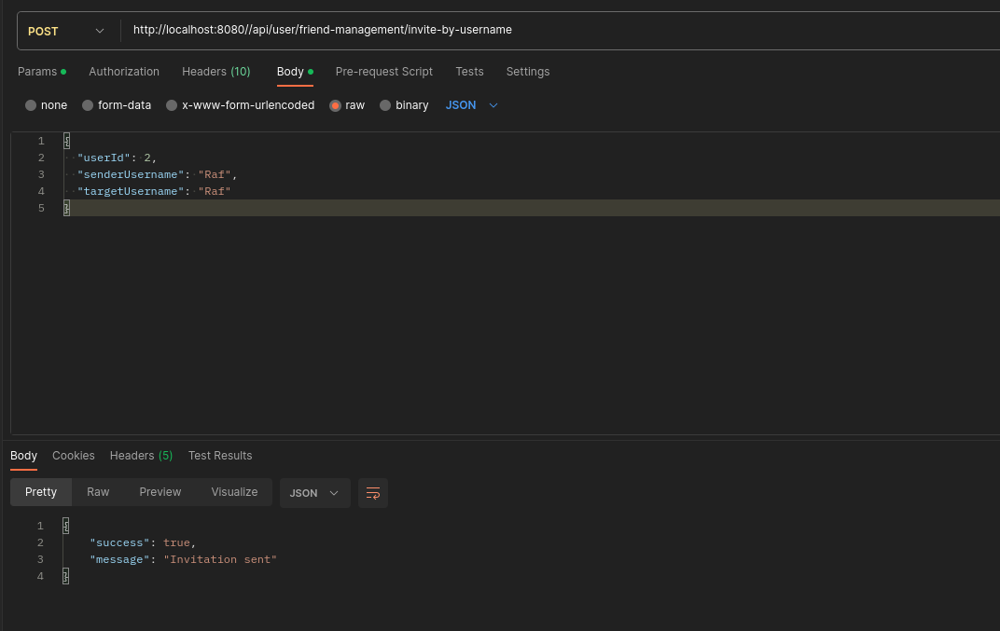

Delete friend :
Should be Not found : 0 only ???!
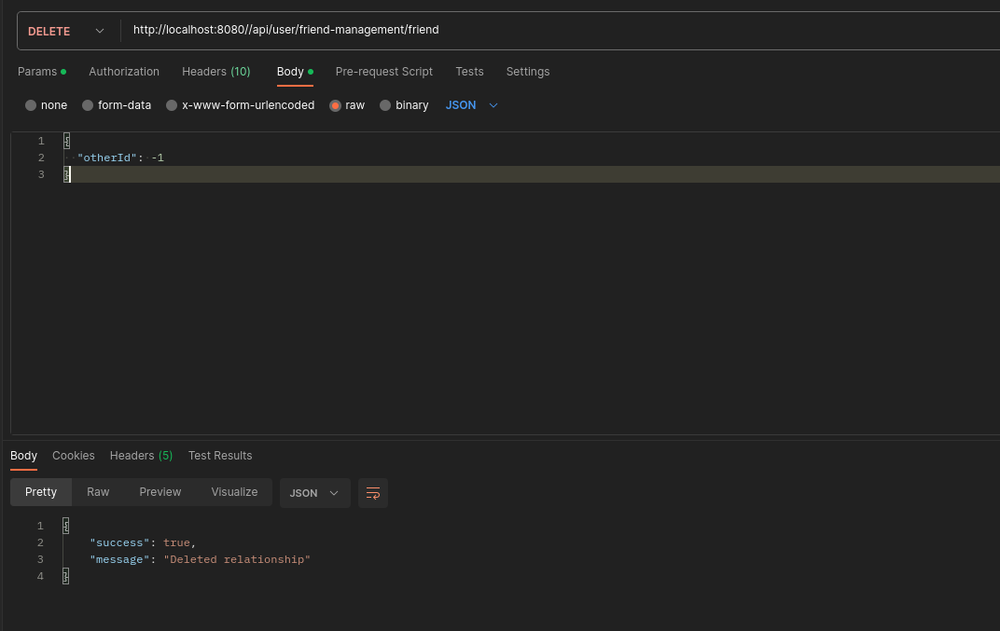

Block:
| **POST** | `/block` | Block a user | Yes | `FriendManagementDto` |
| **DELETE** | `/block` | Unblock a user | Yes | `AddFriendDto` |
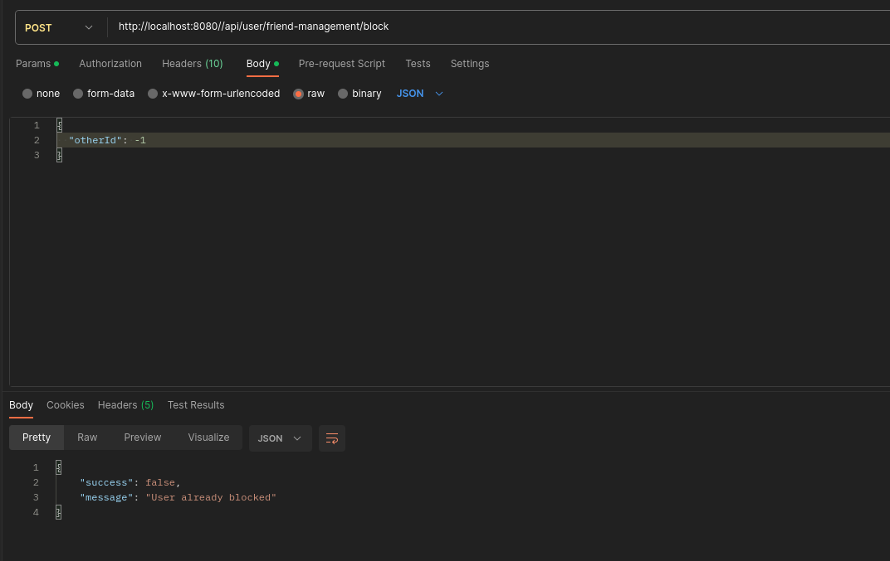
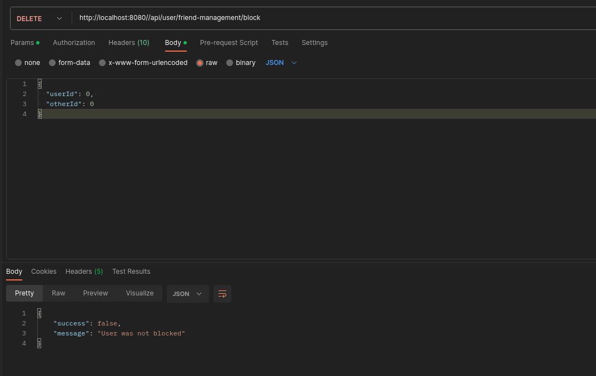
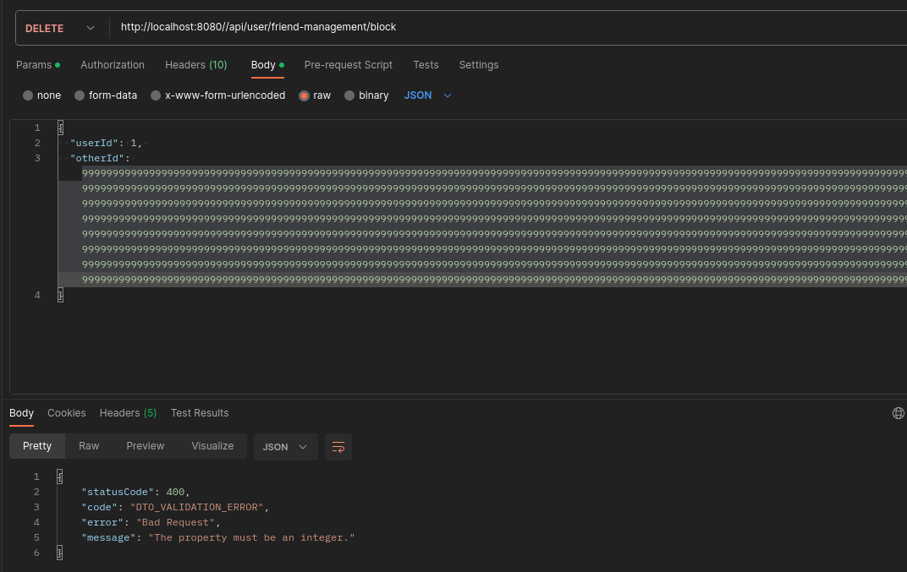